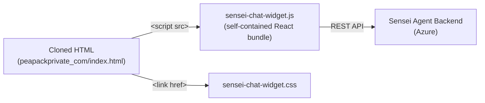

# Inject Sensei Agent Chat Widget into Cloned Sites

## Problem

The `sensei-agent-chat-demo` repo has a fully functional **"Message Us" chat widget** — a floating button (bottom-right) that opens a rich ChatBox with group chat, private chat, team agents, and @mention support. This widget communicates with a backend API at `https://sensei-agents.australiaeast.cloudapp.azure.com/agilent`.

The `osp-website-scraper` serves cloned bank websites (like `peapackprivate_com`) as **static HTML inside iframes**. We need the chat widget to appear on these cloned sites, connected to the same backend.

---

## Key Constraints

| Constraint | Detail |
|---|---|
| **Cloned sites are static HTML** | Served as `index.html` from `public/sites/{id}/` — no React runtime |
| **Sites render in an iframe** | The viewer at `app/sites/[id]/page.tsx` loads them in `<iframe src="/sites/{id}/index.html">` |
| **Chat needs React** | The ChatBox uses React 18, ReactMarkdown, remark-gfm, rehype-raw, Tailwind CSS, and HeroIcons |
| **Backend API must be reachable** | Chat calls `REACT_APP_API_BASE_URL/chat` (currently the Agilent endpoint) |
| **Per-site customization needed** | Different clients will want different agent names, branding, welcome messages |

---

## Proposed Approaches

### Option A — Inject a pre-built React widget bundle into the cloned HTML ⭐ (Recommended)

**How it works:**
1. Build the ChatBox component as a **standalone embeddable widget** (a single JS bundle + CSS file) that self-mounts to the DOM
2. During the scraping/post-processing step, inject a `<script>` and `<link>` tag at the bottom of each cloned site's `index.html`
3. The script creates a `<div id="sensei-chat-root">` and renders the React ChatBox into it
4. Configuration (API URL, agents, branding) is passed via a `window.SENSEI_CHAT_CONFIG` global or data attributes

**Architecture:**


**Pros:**
- ✅ Works inside the iframe — the widget is part of the HTML page itself
- ✅ No cross-origin issues — everything runs in the same document context
- ✅ Clean separation — the widget bundle lives in `public/assets/` and is reusable
- ✅ Easy per-site customization via config object
- ✅ Works with any cloned site, not just Next.js-served ones

**Cons:**
- ⚠️ Requires building a standalone bundle from the ChatBox React component
- ⚠️ Bundle size (~200-300KB with React + dependencies) — acceptable for a chat widget

---

### Option B — Mount the ChatBox at the Next.js viewer level (outside the iframe)

**How it works:**
1. Import and render the ChatBox React component directly in `app/sites/[id]/page.tsx`
2. The chat floats over the iframe as a fixed-position overlay

**Pros:**
- ✅ No bundle build step — just import the component
- ✅ Shares the Next.js React runtime

**Cons:**
- ❌ The ChatBox renders **outside** the iframe — it floats over the browser chrome but is disconnected from the cloned site's visual context
- ❌ Won't work in production if cloned sites are deployed as standalone HTML (without the Next.js wrapper)
- ❌ Tight coupling to the osp-website-scraper app

---

### Option C — Use a `postMessage`-based iframe-in-iframe approach

**How it works:**
1. Embed the chat demo app itself as a second iframe alongside the cloned site
2. Use `window.postMessage` for coordination

**Pros:**
- ✅ Complete isolation

**Cons:**
- ❌ Complex cross-frame messaging
- ❌ Poor UX — separate iframe means separate scroll context, z-index issues
- ❌ Overkill for this use case

---

## Recommended: Option A — Embeddable Widget Bundle

### Implementation Plan

#### Phase 1: Build the Chat Widget Bundle

In the `osp-website-scraper` repo, create a standalone chat widget:

##### [NEW] `lib/chat-widget/ChatWidget.tsx`
- Simplified version of [ChatBox.js](file:///Users/james/workspace/github/sensei-agent-chat-demo/src/ChatBox.js) adapted for vanilla HTML injection
- Self-contained React component with all dependencies bundled
- Reads config from `window.SENSEI_CHAT_CONFIG`

##### [NEW] `lib/chat-widget/index.tsx`  
- Entry point that:
  - Creates a mount `<div>` in the DOM
  - Reads `window.SENSEI_CHAT_CONFIG` for customization
  - Renders `<ChatWidget />` via `ReactDOM.createRoot`

##### [NEW] `lib/chat-widget/chat-widget.css`
- Extracted and namespaced CSS (prefixed with `.sensei-chat-` to avoid conflicts with cloned site styles)
- Includes only the Tailwind utility classes actually used by the widget (purged build)

##### Build Configuration
- Use a simple bundler (esbuild or webpack) to produce:
  - `public/assets/sensei-chat-widget.js` (~single file, self-contained with React)
  - `public/assets/sensei-chat-widget.css`

---

#### Phase 2: Inject into Cloned Sites

##### [MODIFY] `lib/search-interceptor.ts` → rename/extend to `lib/site-injector.ts`
Add a chat widget injection alongside the existing search interceptor:

```html
<!-- Chat Widget Config -->
<script>
  window.SENSEI_CHAT_CONFIG = {
    apiBaseUrl: "https://sensei-agents.australiaeast.cloudapp.azure.com/agilent",
    buttonText: "Message Us",
    title: "Peapack Private Assistant",
    agents: [...],  // per-site agent configuration
    primaryColor: "#0056b3",  // match Peapack branding
    logoUrl: "/sites/peapackprivate_com/fonts/PPG-Logo.svg"
  };
</script>
<link rel="stylesheet" href="/assets/sensei-chat-widget.css">
<script src="/assets/sensei-chat-widget.js"></script>
```

##### [MODIFY] `lib/site-configs.ts`
Add chat-specific configuration per site:

```typescript
export type SiteConfig = {
  clientId: string;
  clientSecret: string;
  tenant: string;
  responseMapper?: (ospData: any) => any;
  // NEW: Chat widget config
  chatConfig?: {
    enabled: boolean;
    apiBaseUrl: string;
    title: string;
    buttonText: string;
    primaryColor: string;
    agents: Array<{ id: string; name: string; title: string; description: string; expertise: string[] }>;
    welcomeMessage?: string;
  };
};
```

---

#### Phase 3: Backend Connectivity

The chat widget connects directly to the existing Sensei Agent backend:

```
Chat Widget (in browser)
    → POST https://sensei-agents.australiaeast.cloudapp.azure.com/agilent/chat
    → POST https://sensei-agents.australiaeast.cloudapp.azure.com/agilent/chat/private/{agent}
```

> [!IMPORTANT]
> **CORS**: The Sensei Agent backend must allow requests from the domain where `osp-website-scraper` is served (e.g., `localhost:3000` for dev, or the production domain). If CORS is not already configured, we'll need to add the osp-website-scraper origin to the backend's allowed origins.

> [!NOTE]
> The chat widget makes direct API calls — no proxy needed in the osp-website-scraper server. The current demo at [chatClient.js](file:///Users/james/workspace/github/sensei-agent-chat-demo/src/chatClient.js) uses `REACT_APP_LOCAL_API_URL` which resolves to `https://sensei-agents.australiaeast.cloudapp.azure.com/agilent`. The same URL will be used in the widget config.

---

#### Phase 4: Apply to `peapackprivate_com` Only (Pilot)

##### [MODIFY] `public/sites/peapackprivate_com/index.html`
Inject the widget script tags before `</body>`:
- The config block with Peapack-specific branding
- The CSS and JS bundle references

The chat widget will appear as a **"Message Us" floating button** in the bottom-right corner — identical to the one in [ChatBox.js lines 664-731](file:///Users/james/workspace/github/sensei-agent-chat-demo/src/ChatBox.js#L664-L731).

---

## Open Questions

> [!IMPORTANT]
> **1. Agent Customization per Client**: Should `peapackprivate_com` use the same Agilent agents (Angela, Sarah, Adam, Luke) or should we create bank-specific agent personas? The current backend seems to be configured for Agilent — do we have a separate backend endpoint for banking clients?

> [!IMPORTANT]
> **2. Backend API URL**: The current demo points to `https://sensei-agents.australiaeast.cloudapp.azure.com/agilent`. Is this the correct endpoint for the Peapack site, or is there a different tenant-specific URL? The backend `chatClient.js` uses `REACT_APP_LOCAL_API_URL` which is set to `https://sensei-agents.australiaeast.cloudapp.azure.com/agilent`.

> [!WARNING]
> **3. CORS Configuration**: Do you have access to configure CORS on the Sensei Agent backend to allow requests from the osp-website-scraper domain? Without this, the chat API calls will be blocked by the browser.

> [!NOTE]
> **4. Asset bundling approach**: Should we use esbuild (simpler, faster) or webpack (already used in sensei-agent-chat-demo) for building the widget bundle? I'd recommend esbuild for simplicity.

---

## Verification Plan

### Manual Verification
1. Build the chat widget bundle
2. Inject into `peapackprivate_com/index.html`
3. Start `osp-website-scraper` dev server (`npm run dev`)
4. Navigate to the Peapack cloned site viewer
5. Verify the "Message Us" button appears in the bottom-right
6. Click it → chat panel should open
7. Send a test message → verify it reaches the Sensei Agent backend and a reply comes back
8. Test private chat functionality
9. Verify no style conflicts with the Peapack bank site CSS

### Automated Tests
- Build verification: `npm run build:chat-widget` produces the expected output files
- Bundle size check: ensure the widget bundle stays under 500KB
